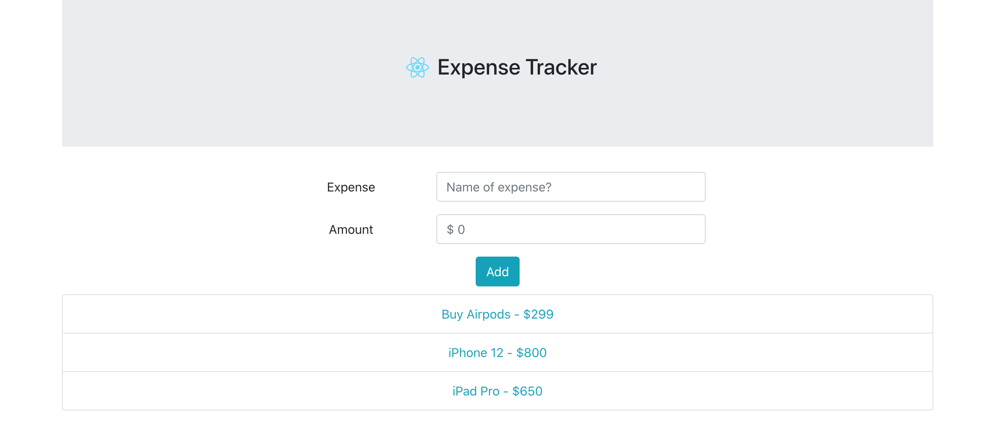
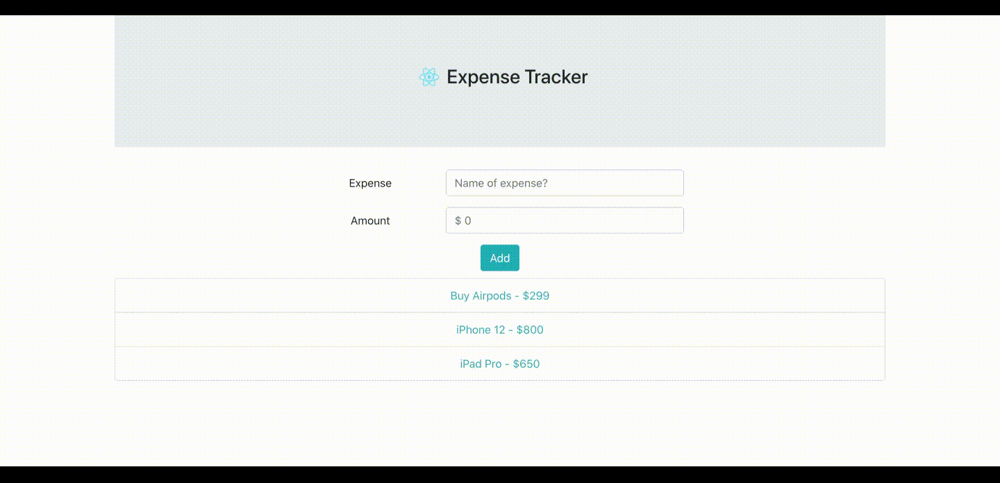

# Expense Tracker App
### Demonstrating the use of useReducer and useContext hooks for application-level state.

## Dependency Checklists
- [x] Bootstrap
- [x] Reactstrap
- [x] UUID
- [x] useReducer Hook
- [x] useContext Hook

## Application Interface

## Working Demo

## How to run the app?

- Clone the repo on to your local setup/directory.
- Run `npm install` to install the dependencies.
- Run `npm start` to start the app.
